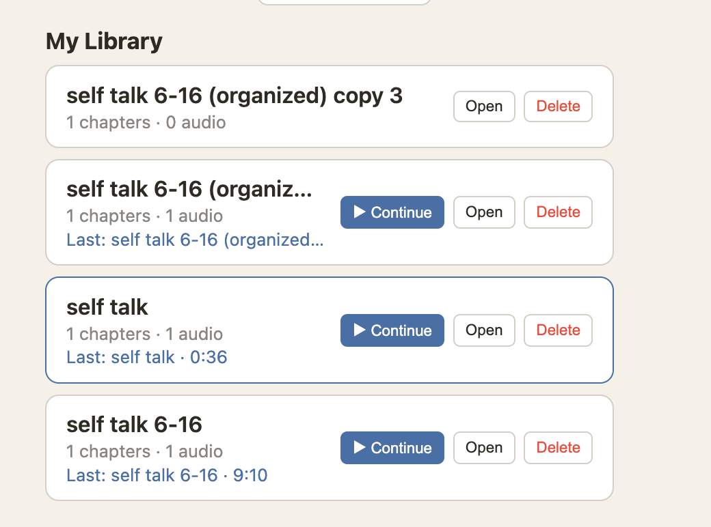

对这个audiobook进行全面升级，使其可以是一个在手机上使用的APP，

我把想听的书上传上去以后，按照目前的选择生成翻译和音频。

然后在手机上的APP里面，可以对这些音频来听。在听的时候，屏幕上可以出现对应的英语文本，并对在发音的句子高亮显示。音频中有中文的，但是不出现中文的文本，只有英语的在屏幕上可以看到文本。文本和音频的进度是匹配的。

一本书可以有很多小节，来选择要听的小节。也有暂停等功能。

另外这个软件可以容纳多个用户，可以记录用户听的内容和进度。

---

可以借鉴 /Users/victor/projects/英语学习/reading ，把这个内容布置在腾讯云上，用户访问audiobook.tumei.online 就可以听了

---

对于目前的音频中如果是英语+汉语+英语 的这个格式的，上一段内容的最后一遍英语音频和下一段的第一遍的英语音频连在了一起，会导致没有区分。在他们之间加上一个短小的提示音符，用以向用户提示这是不同的两段的音频。

另外目前是按照段落进行生产的中英文音频，后续考虑是否有必要按照句子来生成音频。

升级完成，已推送 GitHub 并部署到腾讯云服务器。总结如下：

已完成的升级

1. 音频-文本同步（核心）

- Edge TTS 输出的是恒定码率 MP3，每段音频时长可由字节数精确推算。现在生成音频时会同步产出一条"时间线"：播放时间 → 段落 → 句子（英文段内按句子字符数比例细分）。
- 播放中：正在朗读的英文句子高亮；播到中文音频时，以另一种暖色样式高亮对应的英文段落——屏幕上始终只显示英文文本，符合你的要求。

2. 手机播放器（新增全屏播放页）

- 英文文本自动滚动跟随进度；播放/暂停、±15 秒、上一章/下一章、进度条拖动、倍速（0.75–1.5×）、右上角章节抽屉选小节。
- 支持锁屏/通知栏媒体控制（Media Session），章节播完自动进入下一章。

3. 多用户 + 书库 + 进度记录（IndexedDB 本地存储）

- 首页可新建/切换"听者"档案；书籍、译文、每章 MP3 和时间线都自动保存——刷新或下次打开不用重新生成。
- 每个用户每章的收听进度每 5 秒自动保存，首页书库显示"继续收听"，一键从上次位置续听。数据存在设备本地（无后端服务器）。

4. PWA 手机 APP 化：manifest + Service Worker + 图标，手机浏览器打开后可"添加到主屏幕"，像原生 APP 一样全屏运行、离线可打开。
5. 腾讯云部署（照搬 reading 项目模式）

- 服务器目录、nginx 配置已建好，最新构建已上传，deploy/deploy-tumei.sh 一条命令即可日常更新。GitHub Pages 版本不受影响（构建时区分 base 路径）。

⚠️ 需要你做的一步

DNSPod 没有 API 自动化，请在 DNSPod 控制台 → tumei.online 添加一条记录：

▎ 主机记录 audiobook　类型 A　记录值 43.139.242.52

我已在后台启动监测脚本：DNS 一生效就自动签发 HTTPS 证书，之后 <https://audiobook.tumei.online> 即可访问（若超过 2 小时未加记录，脚本会退出，手动命令在 deploy/README.md 里）。

验证情况

- 全部 280 个单元测试通过（新增 27 个时间线同步测试）。
- 浏览器端到端验证：上传 HTML 书 → 解析 2 章 → 真实调用微软翻译成功 → 刷新后书库和译文完整保留 → 播放器正确渲染并高亮句子。
- 两个环境限制说明：本机代理拦截了 Edge TTS 的 WebSocket（所以本机测试时音频生成失败——这是网络环境问题，代码路径与之前可用版本一致）；自动化 Chrome 标签页不解码音频，真实播放请在手机/正常浏览器上体验。

✻ Worked for 9m 13s

※ recap: Upgraded the audiobook app into a mobile PWA with synced sentence highlighting, multi-user progress, and library; all tested, pushed, and deployed to Tencent Cloud. Next: add the DNSPod A record "audiobook" to 43.139.242.52 so HTTPS goes live. (disable recaps in /config)

❯ 这一步具体怎么做 ，请在 DNSPod 控制台 → tumei.online 添加一条记录：

▎ 主机记录 audiobook　类型 A　记录值 43.139.242.52

Translation: "How exactly do I do this step — adding a record in the DNSPod console → tumei.online: host record audiobook, type A, value 43.139.242.52?"

具体操作步骤如下（手机或电脑浏览器都可以，约 1 分钟）：

DNSPod 控制台添加解析记录

1. 打开 DNSPod 控制台：访问 <https://console.dnspod.cn/> ，用管理 tumei.online 的那个账号登录（就是当初给 read、word、wordtest 添加解析的账号；如果平时从腾讯云控制台进，也可以走 腾讯云控制台 → 搜索"DNSPod"→ 域名解析列表）。
2. 进入域名：在"我的域名"列表里点击 tumei.online，进入它的记录管理页。你应该能看到已有的 read、word、wordtest、wordtest1、home 等记录。
3. 点击"添加记录"按钮，按下面填写：

| 字段   | 填写内容          |
| ---- | ------------- |
| 主机记录 | audiobook     |
| 记录类型 | A             |
| 线路类型 | 默认            |
| 记录值  | 43.139.242.52 |
| TTL  | 600（保持默认即可）   |

3. 最省事的办法：找到已有的 read 那条记录，它除了主机记录以外其他都一样，照着填就行。
4. 点"确认/保存"。

之后不用再做任何事

- 记录保存后一般 1～10 分钟内全网生效。
- 我在你电脑后台留了一个监测脚本，每分钟检查一次 DNS：一旦生效，它会自动 SSH 到服务器签发 HTTPS 证书并强制跳转 HTTPS。
- 之后用手机浏览器打开 <https://audiobook.tumei.online> 就能用了；建议在手机上点浏览器菜单里的"添加到主屏幕"，就会像一个独立 APP 一样出现在桌面。

如果你想确认是否生效，可以在终端里输入：! dig +short audiobook.tumei.online，返回 43.139.242.52 就说明解析已生效。

另外——如果你已经在这台电脑的 Chrome 里登录过 DNSPod，我也可以直接帮你在浏览器里操作添加这条记录，你说一声即可。

✻ Sautéed for 23s

❯ 保存了

Translation: "Saved."

好，我来验证 DNS 是否生效，并直接签发 HTTPS 证书：

Ran 1 shell command

DNS 已生效。停掉后台监测脚本，直接签发证书：

Ran 2 shell commands

⏺ Background command "Start background watcher: poll DNS, then auto-run certbot for HTTPS" failed with exit code 144

✅ 全部上线成功！

- <https://audiobook.tumei.online> 已可访问：HTTPS 200、证书验证通过、HTTP 自动跳转 HTTPS
- PWA 组件正常：sw\.js（离线支持）和 manifest.webmanifest（添加到主屏幕）都返回 200

现在你可以在手机上：

1. 用浏览器打开 audiobook.tumei.online
2. 浏览器菜单 → "添加到主屏幕"，它会以独立 APP 的形式出现在手机桌面
3. 上传书籍 → 生成翻译和音频 → 点章节的 ▶ Listen 进入播放器：英文句子跟着音频高亮，播中文时高亮对应英文段落；书籍、音频、每个用户的收听进度都自动保存在手机上，下次打开可直接"继续收听"

日后更新代码，只需 bash deploy/deploy-tumei.sh 一条命令即可重新发布。

---

对这个软件继续修改，对于用户界面，用户登陆自己的账户后，不能自己生成音频，而是通过联系管理员：微信tumei321123，由管理员我将他们的书籍生成音频，生成了音频后，在他们的APP界面可以看到这个书籍的音频，他们可以进行听音频和看文本学习。优化相关的显示界面

我作为管理员，可以将很多书生成音频做成内容库，然后管理员可以指定某些人对某些具体的书籍具有访问使用权限，而不是所有人对所有书籍都有使用权限

当我在 [https://audiobook.tumei.online/#admin 生成了新的音频内容以后，新的可分配的资源应该出现在 访问码管理.xlsx  里面，以便于我来分配](https://audiobook.tumei.online/#admin)

---

对于目前的我在 在 #admin 生成音频，用户在 [https://audiobook.tumei.online 获得指定的音频 ，对于这个过程进行优化](https://audiobook.tumei.online)

---

对于音频中英语和汉语的翻译，可以是逐句，也可以是逐段进行翻译

目前先不管访问权限的问题，先把系统改成我作为管理员上传了书籍以后，所有人从他们的端口进去，都可以访问

---

点击发布到网站按钮后，应该有结果反馈发布成功与否

---

对于音频中英语和汉语的翻译，可以是逐句，也可以是逐段进行翻译

增加repeat each sentence的选项，并将 EN ZH EN(repeat each sentence)设为默认选择

在EN ZH EN模式中上一句的最后一次英语和下一句开始的英语音频之间有一个间隔提示音
